<!--
HOW THIS FILE IS BUILT
Each block between two "---" lines is one slide. The text on a slide is kept short;
the longer explanation sits in the "Notes" comment under it, which becomes the speaker notes.
Pictures live in docs/assets/screenshots. A slide marked "Screenshot to capture" still needs one.
Make a PowerPoint with:  npx @marp-team/marp-cli README-ENDUSER.md --pptx
-->

# InnoCalc
## How to use it - the simple version

InnoCalc is where Innovis engineers **do**, **keep** and **send** their calculations.

Version v0.0.1

<!-- Notes: This guide explains InnoCalc as simply as possible. If you can use a web page,
you can use InnoCalc. Every picture in this guide is a real screen. -->

---

## What is InnoCalc?

Think of InnoCalc as a **tidy school bag** for calculations.

* It helps you **work out** the sum (a calculation).
* It puts each sum in the **right folder** for the right project.
* It **packs** sums together to send to a checker.
* It keeps the **checker's comments** until every one is answered.

<!-- Notes: Nothing is stored inside InnoCalc itself. Everything is saved in the project's own
folder on the projects drive, so it is still there even if InnoCalc is switched off. -->

---

## Step 1 - Start InnoCalc

1. Double-click **InnoCalc.bat**.
2. A black window opens. **Leave it open** - it is InnoCalc's engine.
3. Your web browser opens InnoCalc by itself.

If the browser does not open, go to **http://127.0.0.1:8125**.

<!-- Notes: Closing the black window switches InnoCalc off. Once InnoCalc runs on the office
server you will just open a web address instead. -->

---

## Step 2 - Say who you are

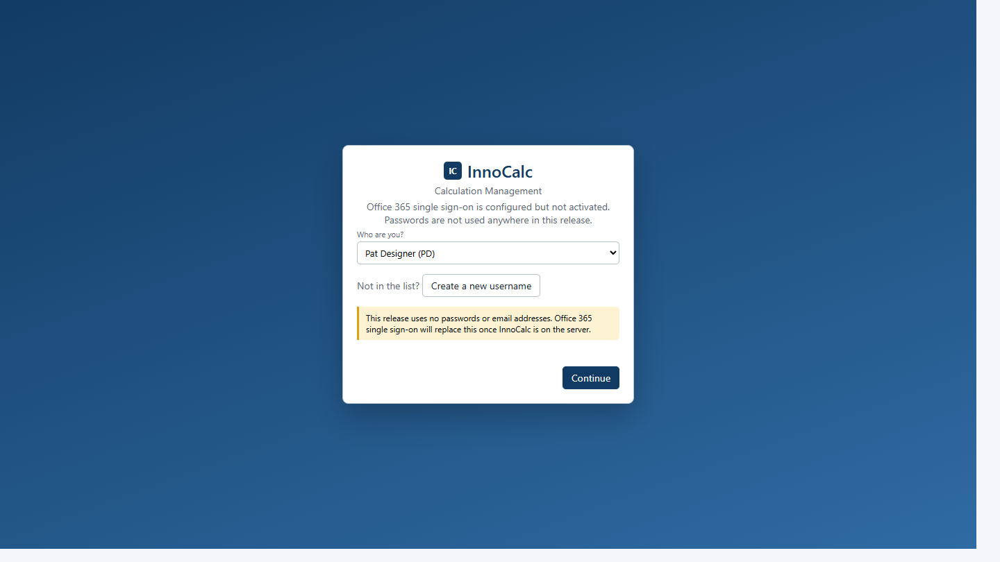

* Pick **your name** from the list and press **Continue**.
* Not in the list? Press **Create a new username**.

<!-- Notes: There is no password and no email address. InnoCalc only needs to know who you are
so it can put your initials on your calculations. When InnoCalc moves to the server you will
sign in with your normal Microsoft account instead. Please only ever pick your own name. -->

---

## New here? Make your username

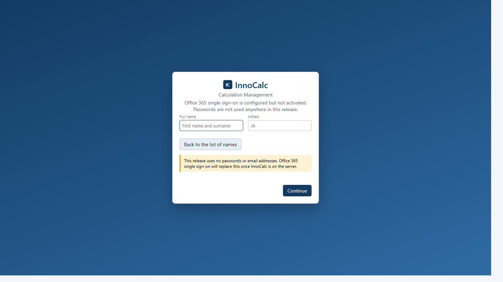

* Type your **first name and surname**.
* Type your **initials** (these go on every sheet you print).
* Press **Continue**. Next time, just pick your name.

<!-- Notes: If your name is already there, InnoCalc tells you to choose it from the list
instead of making a second one. -->

---

## The top bar - your map

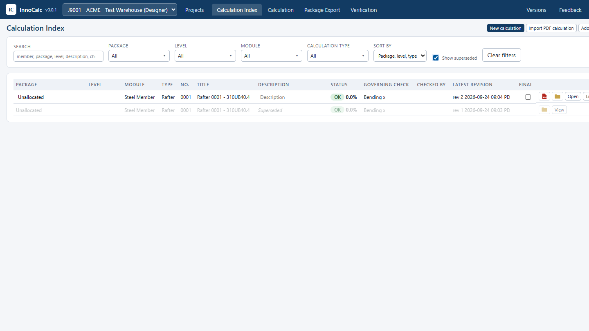

| Button | What it is |
|--------|------------|
| **Projects** | Find and open a job |
| **Calculation Index** | The list of all sums in this job |
| **Calculation** | Where you do a sum |
| **Package Export** | Pack sums into one PDF *(admins for now)* |
| **Verification** | The checker's comments *(admins for now)* |
| **Feedback** | Tell us about a problem or an idea |

<!-- Notes: Package Export and Verification are only shown to admins until PDF printing has
passed its checks. Everyone else sees them once they are switched on. -->

---

## Step 3 - Open your project

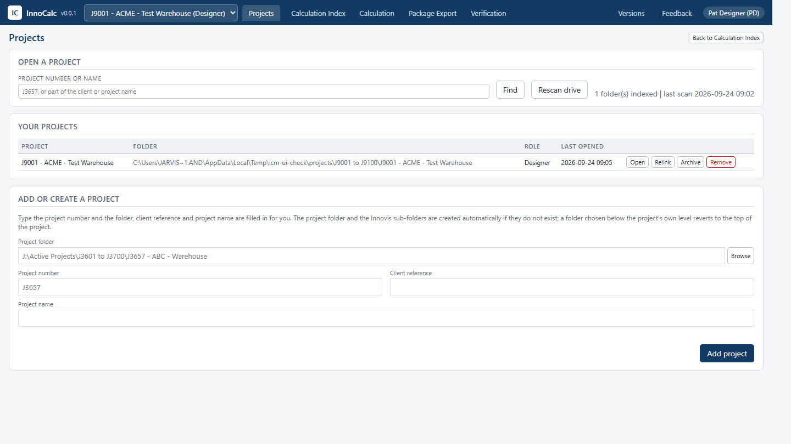

1. Press **Projects**.
2. Type the **job number** (like `J3657`) and press **Find**.
3. Press **Add and open**.

<!-- Notes: Next time the job is already in "Your projects" and in the drop-down in the top bar.
Typing part of the client or project name works too. If the job's folder does not exist yet,
fill in "Add or create a project" and InnoCalc makes the folder and the Innovis sub-folders. -->

---

## Step 4 - Start a new calculation

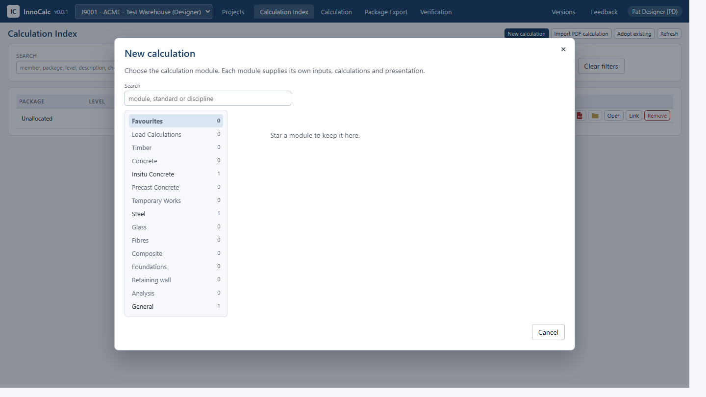

1. On the **Calculation Index**, press **New calculation**.
2. Pick the **type of structure** on the left (Steel, Concrete, General...).
3. Click the **calculation** you want.

<!-- Notes: Press the star on a card to keep it in Favourites. The search box finds a module
by its name or the standard it follows. -->

---

## Step 5 - Fill in the boxes

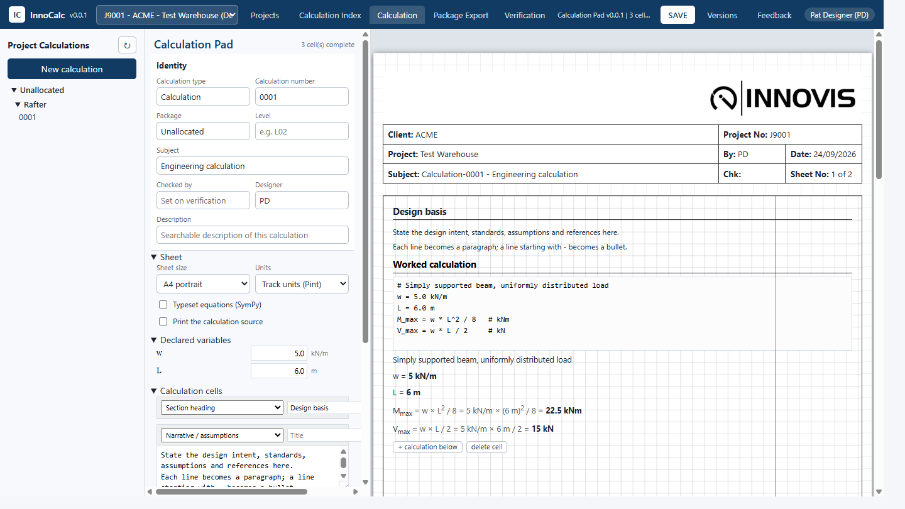

* **Left:** the boxes you type into (the *inputs*).
* **Right:** the printed sheet. It **changes as you type**.
* Red means something is **not OK** - read the message.

<!-- Notes: Give it a Type and Number (for example Beam 0001), a Package and a Level, so it is
filed in the right place and easy to find. -->

---

## Step 6 - Save

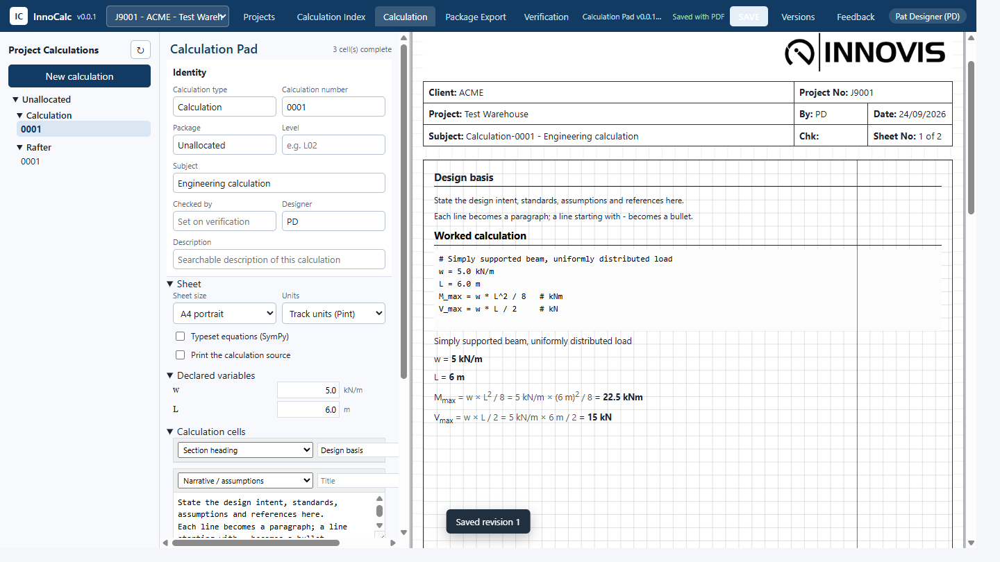

* Press **SAVE** in the top bar (or **Ctrl + S**).
* A **yellow dot** means "you have changes that are not saved".
* InnoCalc saves the sheet, then prints its PDF by itself.

<!-- Notes: Saving again makes a new revision. The old one is not thrown away: it moves into a
"superseded" folder and is still listed if you tick Show superseded. -->

---

## Step 7 - Find it again

* The **Calculation Index** lists every calculation in the job.
* Use **Search** and the drop-downs to find one.
* Tick **Show superseded** to see **old versions** in grey.
* The red **PDF** symbol opens the PDF, the yellow **folder** symbol opens the folder, and
  **Open** opens the calculation.

<!-- Notes: You can change the Package, Level and Description straight in the table. Tick
"Final" when a calculation is finished. -->

---

## Step 8 - Send sums to a checker *(admins for now)*

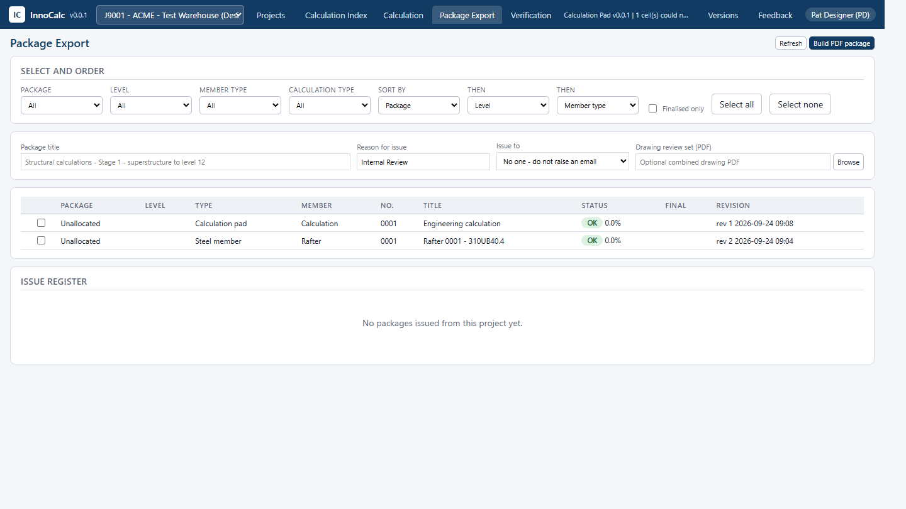

1. **Package Export**: tick the calculations and put them in order.
2. Give the package a title and a **reason for issue**.
3. Press **Build PDF package** - one PDF with a contents page.

<!-- Notes: The package is stamped "PACKAGE PREPARED <date> FOR <reason>" and cannot be edited,
but the checker can still mark it up in Bluebeam. -->

---

## Step 9 - Answer the checker *(admins for now)*

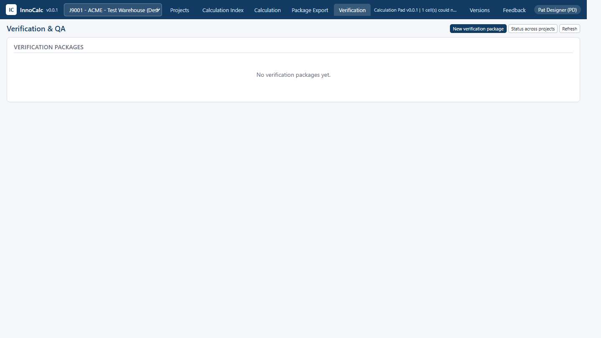

* The checker marks up the PDF and puts it back in the folder.
* Their comments appear in **Verification** by themselves.
* Answer each one until they are all **Closed** (or agreed to be **Deferred**).

<!-- Notes: Only the nominated verifier can endorse the package. When they do, their initials
appear in "Checked by" on each calculation. -->

---

## Something wrong? Tell us!

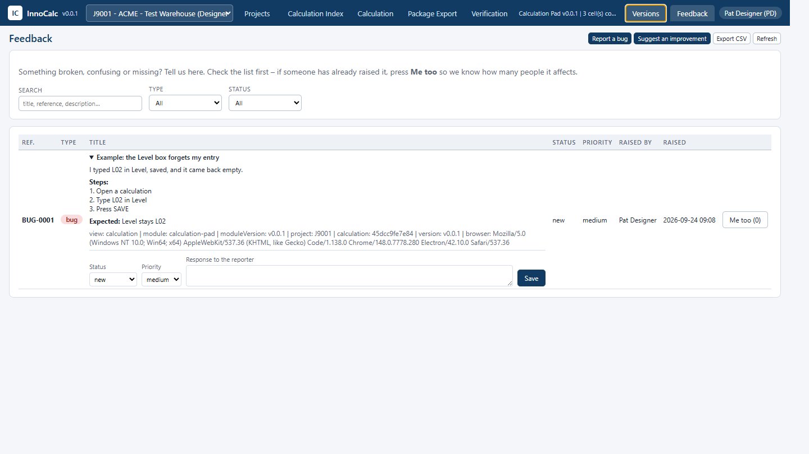

1. Press **Feedback**.
2. Look at the list first - if it is already there, press **Me too**.
3. If not, press **Report a bug** or **Suggest an improvement**.

<!-- Notes: InnoCalc adds the page you were on, the calculation and the version to your report,
so you do not have to. Admins give each report a status and can reply. -->

---

## Writing a good bug report

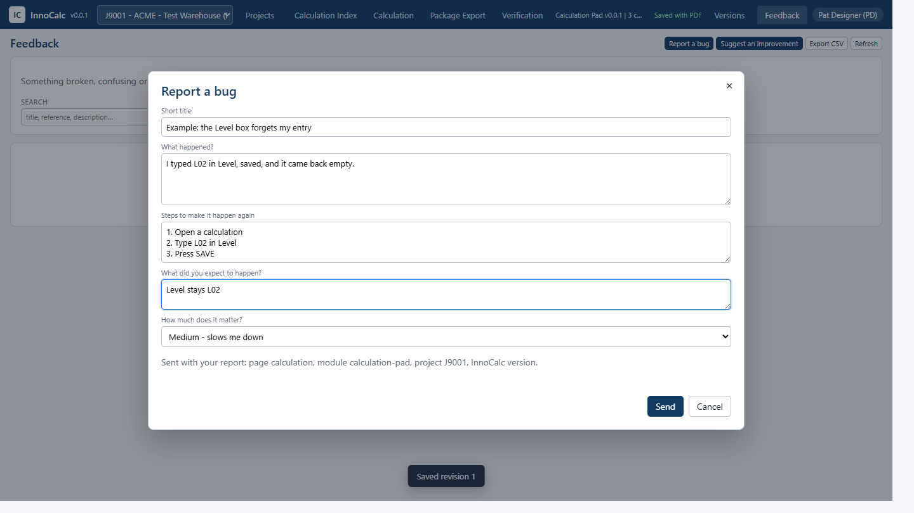

* **Title:** what went wrong, in a few words.
* **Steps:** 1, 2, 3 - what you pressed.
* **Expected:** what you thought would happen.
* **Critical** = a wrong engineering answer or lost work.

<!-- Notes: "It broke" is hard to fix. "I typed L02 in Level, pressed Save, and it came back
empty" is easy to fix. -->

---

## What version am I using?

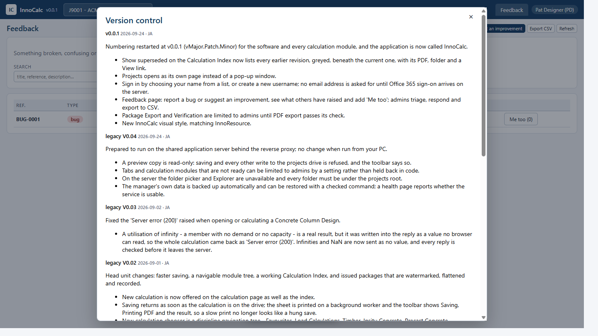

* The number next to **InnoCalc** in the top bar, like **v0.0.1**.
* Press **Versions** to see what changed.
* **v Big . Fix . Small**: the first number means results may change; the second is a fix;
  the third is a small tidy-up.

<!-- Notes: Every calculation remembers the version of the module that made it, so it is always
clear which version a saved sheet came from. -->

---

## The golden rules

1. **Pick your own name.** Your initials go on the sheets.
2. **Save often.** Watch for the yellow dot.
3. **Don't move files by hand** in the calculation folders - let InnoCalc do it.
4. **Keep the black window open** while you work.
5. **Tell us** when something is odd - use Feedback.

<!-- Notes: Moving or renaming calculation files in Explorer breaks the Calculation Index's
links. Use Package, Level and Remove in the index instead. -->

---

## Help

* **Training for the Calculation Pad:** `docs/training/InnoCalc - Calculation Pad Training.pptx`
* **Making new calculation types:** [README-USER-CALCDEVELOPMENT.md](README-USER-CALCDEVELOPMENT.md)
* **What is coming next:** [ROADMAP.md](ROADMAP.md)

<!-- Notes: Screenshot to capture later: a verification package with an imported comment and a
built package PDF with its contents page, once PDF export has passed its checks. -->
