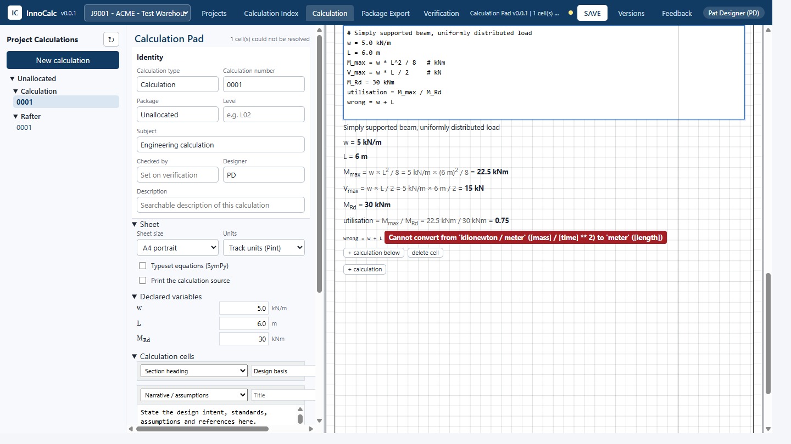

<!--
HOW THIS FILE IS BUILT
Each block between two "---" lines is one slide; the "Notes" comment under it becomes the
speaker notes. Pictures live in docs/assets/screenshots. Slides marked "Screenshot to capture"
still need one. Make a PowerPoint with:
  npx @marp-team/marp-cli README-USER-CALCDEVELOPMENT.md --pptx
The full technical references are docs/MODULE-SPECIFICATION.md, docs/NEW-MODULE-BRIEF.md,
docs/DEVELOPMENT.md and calculations/readme_CalculationPreparation.md.
-->

# Developing calculation packages for InnoCalc

How to add a new calculation type, and how to prove it gives the right answers.

Version v0.0.1

<!-- Notes: Audience: engineers who own a calculation and developers (or an AI assistant)
implementing it. You do not need to know how the manager works to add a module. -->

---

## The big idea

A calculation package (a **module**) is a **calculator in a box**.

* InnoCalc hands the box some **inputs**.
* The box hands back **results** and a **printed sheet**.
* The box never saves files, draws the web page or prints PDFs - InnoCalc does that.

So a new module needs **no change to InnoCalc itself**.

<!-- Notes: This separation is what lets one head application host steel, concrete, pad and
future modules. The web form is drawn from a schema the module publishes. -->

---

## Two ways to make a calculation

| Need | Use |
|------|-----|
| A one-off or unusual sum | **Calculation Pad** - write it in the sheet, no code |
| The same check done many times, to a standard | A **module** - coded, tested and validated once |

Rule of thumb: when the third engineer re-types the same pad, make it a module.

<!-- Notes: The Calculation Pad training deck is docs/training/InnoCalc - Calculation Pad
Training.pptx. The rest of this guide is about modules. -->

---

## The road from idea to release

1. **Brief** - write down the engineering (no code yet).
2. **Scaffold** - the generator makes the empty module.
3. **Engine** - the equations, with every intermediate value.
4. **Sheet** - the printed calculation.
5. **Test** - arithmetic, limits and bad inputs.
6. **Validate** - compare against independent references.
7. **Review** - an independent engineer signs off.
8. **Release** - switch it on in `suite.toml`, give it a version.

<!-- Notes: Steps 1, 6 and 7 are engineering steps and cannot be delegated to software. The
contract check proves the software fits InnoCalc; it does not certify the engineering. -->

---

## Step 1 - Write the brief

Copy `docs/NEW-MODULE-BRIEF.md` and fill in **Part B**:

* **Identity** - name, standard *including amendments*, filing folder, owner.
* **Scope** - what it does and, just as important, what it does **not** do.
* **Inputs** - every field, unit, default and allowed range.
* **The calculation** - clause by clause, with equation references.
* **Sheet layout** - what the checker needs to see.
* **Validation evidence** - which worked examples or reference sheets prove it.

<!-- Notes: Part A of the brief holds fixed requirements (architecture, files, prohibited
patterns) so an AI implementer cannot drift. An incomplete brief is the most common cause of
rework. -->

---

## Step 2 - Scaffold the module

```
python -m tooling new timber-member --name "Timber Member Design" ^
  --category Timber --standard "AS 1720.1:2010" ^
  --filing-folder "TIMBER MEMBER" --owner "Responsible engineer"
```

Creates `calculations/timber/timber_member/` with `engine.py`, `report.py`,
`headless.py`, `module.toml`, `version.py` (**v0.0.1**) and failing tests -
and a **disabled** entry in `suite.toml`.

<!-- Notes: The generator refuses an existing id, filing folder or destination. The module id
and filing folder are permanent once calculations are filed with them. The release tests fail
deliberately until you implement the module. -->

---

## What goes in each file

| File | Job |
|------|-----|
| `engine.py` | The engineering. Numbers in, numbers out. No HTML. |
| `report.py` | The printed sheet. **Never recalculates.** |
| `headless.py` | The seven contract functions InnoCalc calls. |
| `module.toml` | Identity, standard, owner, status. |
| `version.py` | `VERSION` and the change history. |
| `tests/` | Contract and engineering release gates. |
| `examples/`, `reference/` | Reviewed inputs and original evidence. |

<!-- Notes: The seven functions are descriptor, schema, defaults, compute, render, summarise and
identity. Optional: exchange/accepts/apply_exchange (sending values between modules),
run_action (module buttons) and validate. Full detail: docs/MODULE-SPECIFICATION.md. -->

---

## Step 3 - The engine: show your working

* Return **every intermediate value**, not just the answer - the checker needs them.
* `util` maps each check to a utilisation; `worstUtil` is the largest finite one.
* A failing design is a **result** (`status: FAIL`), not an error.
* Bad input is an error: raise `ValueError` with a message a person understands.
* Same inputs, same answer, every time. Never change the input document.

<!-- Notes: Unattainable checks (zero capacity) must never report OK - the contract check tests
this. Keep units explicit in names (force_kN, length_mm) and convert once at the boundary. -->

---

## Step 4 - The sheet

* Build it with the shared `calcpad` package so it looks like every other Innovis sheet.
* Print references (clause numbers) beside each check.
* Show the substitution line, not just the result.
* Keep `render()` pure: it only formats what `compute()` returned.



<!-- Notes: The screenshot shows the Calculation Pad's three-step display (formula,
substitution, result); modules follow the same convention. Screenshot to capture: a module
sheet with clause references once the first new module exists. -->

---

## Step 5 - Test like a checker would

| Test | Proves |
|------|--------|
| Arithmetic | Independent values for each factor, capacity and interaction |
| Limits | At, just below and just above each boundary, and utilisation 1.0 |
| Bad input | Missing, malformed, NaN, wrong type, impossible combinations |
| Check on/off | Each optional check alone; mandatory checks forced on |
| Units and signs | Tension/compression and axis conventions |
| Failure | Zero capacity, non-convergence, extreme values |
| Sheet | Long text, escaping, pagination, no recomputation |

Zero-load defaults prove **nothing** about the design.

<!-- Notes: The full matrix is in calculations/readme_CalculationPreparation.md section 15.1.
Tests must include non-zero and failing designs. -->

---

## Step 6 - Validate: the recommended pathway

1. **Hand check** one case per clause, independently, before coding.
2. **Worked examples** from the standard, textbooks or published guides.
3. **Reference software** sheets (e.g. the previous in-house tool) - extract them with a
   script, never by retyping.
4. **Boundary sweep** - vary each input across its range and look for jumps.
5. **Peer review** of the discrepancies, not just the passes.

Compare **intermediate values** and the **governing** utilisation, not only the headline.

<!-- Notes: Levels 1-2 are mandatory for every module. Level 3 is expected whenever an earlier
tool or reference corpus exists (Steel was validated against DCT and the frozen V6.0 engine;
Concrete against the Structural Toolkit baseline). -->

---

## Validation cases are data

```json
{"cases": [{
  "name": "AS 1720.1 Example 3.2 - checked by AB",
  "inputs": {"span_m": 4.2, "load_kNpm": 6.0},
  "tolerance": 0.001,
  "expect": {"capacity.Md_kNm": 18.4, "util.bending": 0.72}
}]}
```

```
python -m tooling dev timber-member --validate worked-cases.json
python -m tooling check timber-member --validate
```

`ok` is **false** if a case fails, is missing, or nothing was actually compared.

<!-- Notes: Values above are illustrative only. Per-path tolerances override the global one;
zero expected values need an absolute tolerance; allow for the reference's printed rounding
(half of the last printed digit) rather than widening tolerances to hide differences. -->

---

## When the numbers disagree

Classify every discrepancy **before** touching the engine:

* **Module defect** - fix it, with a source for the correction.
* **Extraction defect** - the reference was read wrongly.
* **Reference conservatism** - allowed, but record the direction.
* **Out of scope** - a bespoke rule, not a standard clause.
* **Catalogue data gap** - section properties or material data differ.

Never tune the engine to make a reference match.

<!-- Notes: Verify one representative discrepancy by hand first. Re-run both the reference
comparison and the regression suite after any correction. The independent reviewer, not the
developer or an AI, decides whether residual differences are acceptable. -->

---

## Step 7 - Independent review

The reviewer receives:

* The completed **brief**.
* The **validation report**: cases, sources, tolerances, results, residuals.
* The **sheet** for a typical and a failing case.
* The **test** results.

Only after sign-off: set `status = "available"` in `module.toml`.

<!-- Notes: Record the reviewer and date in the module's version history entry. -->

---

## Step 8 - Release and versions

* Switch it on: `enabled = true` in `suite.toml`, restart InnoCalc.
* Versions are **vMajor.Patch.Minor**, starting at **v0.0.1**:

| Bump | When | Example |
|------|------|---------|
| **Major** | Results or saved inputs may change - re-verify | v0.4.2 -> v1.0.0 |
| **Patch** | A correction or addition; saved calculations stay valid | v0.4.2 -> v0.5.0 |
| **Minor** | Wording or presentation only; identical results | v0.4.2 -> v0.4.3 |

* Add a `VERSION_HISTORY` entry for every change a user will see.

<!-- Notes: packages/innocalc_sdk/versioning.py parses and bumps versions; the contract check
rejects any other format. pyproject.toml carries the same numbers without the "v". Every saved
revision records the module version that produced it. -->

---

## Commands you will use

```
python -m tooling dev <id> --schema          the form definition
python -m tooling dev <id> --trace           every intermediate value
python -m tooling dev <id> in.json --html out.html
python -m tooling check <id> --validate      contract + self-validation
python -m unittest discover -s calculations/<discipline>/<module>/tests -v
validate.bat                                 whole suite
python -m tooling.smoke                      save, reopen and PDF through InnoCalc
python -m tooling release-check              refuses dirty or unpushed repositories
```

<!-- Notes: Run the smoke test with PDF on at least one machine before release; the --no-pdf
variant is explicitly not evidence that PDF export works. -->

---

## Where things live

* Spec: `docs/MODULE-SPECIFICATION.md`
* Brief template: `docs/NEW-MODULE-BRIEF.md`
* Step-by-step implementation guide: `calculations/readme_CalculationPreparation.md`
* Development commands: `docs/DEVELOPMENT.md`
* What is planned: [ROADMAP.md](ROADMAP.md)
* Using InnoCalc: [README-ENDUSER.md](README-ENDUSER.md)

<!-- Notes: Steel, Concrete Column and Calculation Pad are Git submodules; commit and push the
module repository, then commit the pointer in the suite. -->
